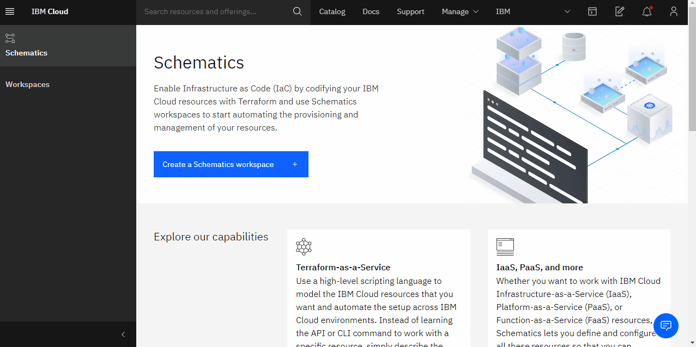
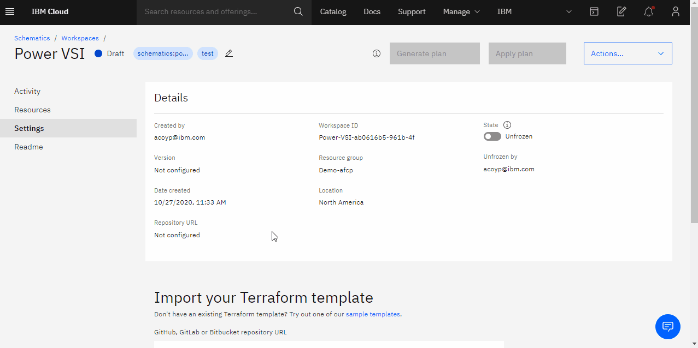
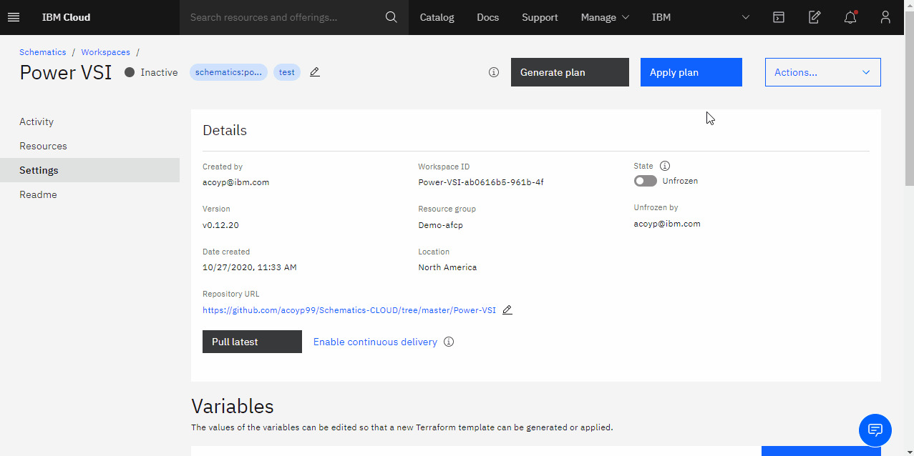
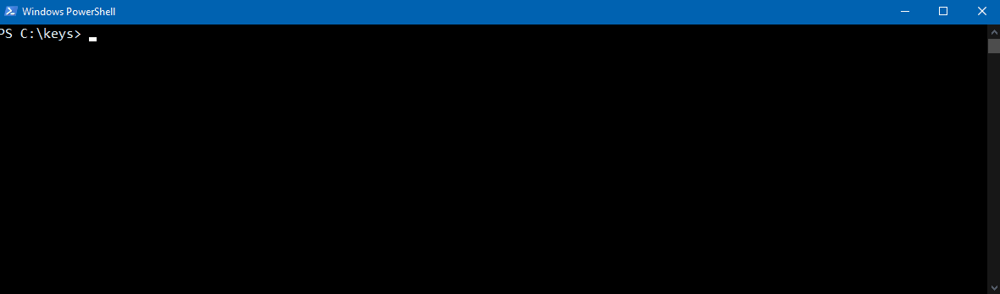

# PowerVS Schematics

_Este repositorio contiene el script para el despliegue de una instancia virtual Power en IBM Cloud_

## Contenido 📋

1. Archivo principal de aprovisionamiento de recursos
2. Archivo de variables de IaC
3. Provider para confirmación de autorizaciones para el aprovisionamiento de recursos en IBM Cloud

## Procedimiento

Se procede a crear un workspace en IBM Cloud de la siguiente manera

### Pasos para el despliegue en Schematics 🔧

Se debe dirigir al simbolo de  en donde encontrará la opción de **Schematics** una vez alli se creará un nuevo workspace como se muestra a continuación:


Luego de asignar los atributos y crear el WORKSPACE se procede a importar el github que contine la plantilla para el aprovisionamiento de la siguiente manera:


Luego de ello se procede a ingresar las variables establecidas en la plantilla, para las siguientes variables se tienen valores por defecto o apciones dependiendo el usuario

- **ibm_region**: Valor por defecto us-south
- **sshkeyname**: Ingresar un nombre cualquiera para la llave a crear
- **instancename**: Ingresar un nombre cualquiera para la VSI a crear en Power
- **networkname**: Ingresar un nombre cualquiera para el network a crear para la VSI en Power
- **cidr**: Dirección IP con prefijo en clase C EJ: 192.168.##.0/24
- **memory**: Capacidad RAM tipo **number** entero >= 2
- **processors**: Capacidad CPUs en **float** >= 0.25 en multiplos de 0.25 EJ= 0.25/0.5/0.75/1.25....

Para las demás variables se requieren configuraciones como se muestra a continuación de cada una de ellas:

#### ibmcloud_api_key

Para esta variable se debe ingresar en IAM para proceder a crear una API-KEY que permita el aprovisionamiento de recursos para la identificación del usuario como se muestra a continuación:


#### sshkey

Para esta variable se requiere crear una llave SSH publica por medio de linea de comandos con el siguiente comando:
```
ssh-keygen -m PEM -t rsa -f "NOMBRE_DE_LA_LLAVE"
```
Con ello se obtienen 2 llaves; 1 pública y 1 privada. En este caso se copia la llave pública y se **debe guardar la llave privada para posibles accesos futuros** 
El proceso se muestra a continuación:



#### 


Se debe generar el plan con el botón que aparece en pantalla y de generarse correctamente se podrá aplicar el plan. _Solo hasta aplicar el plan se va a generar facturación_

---
#### Autores: IBM Cloud Tech Sales

## Referencias

IBM Cloud provider for Terraform 
https://ibm-cloud.github.io/tf-ibm-docs/

Terraform provider - HashiCorp
https://www.terraform.io/docs/providers/index.html
